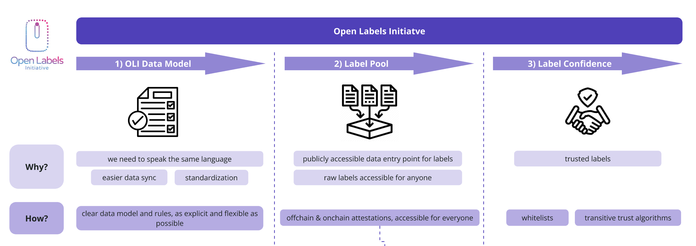

# Open Labels Initiative
***A standardized framework and data model for EVM address labeling***

Upcoming community calls can be found in our [Google Calendar](https://calendar.google.com/calendar/u/3?cid=MmQ0MzYxNzQ3ZGFiY2M3ZDJkZjk0NjZiYmY3MmNmZDUwZTNjMjE2OTQ4YzgyNmI4OTBmYjYyN2VmNGRjNjQ4OEBncm91cC5jYWxlbmRhci5nb29nbGUuY29t)!

## Goal
This initiative tackles the issue of isolated and non-standardized datasets of address labels within the blockchain community. It introduces a flexible, open and community owned data framework for anyone to use and contribute to. 

By aligning on a single framework for address labels, we streamline our labeling efforts, avoid redundant work and make it easier to share datasets within the community.

The OLI repository functions as the community maintainer of the OLI framework. Additionally, it serves as a neutral entity that provides tools for data entry through attestations and automated activity tagging.

## The 3 pillars of OLI
  - **1) Data Model:** We all speak the same language when it comes to labels. This framework allows us to easily sync labels between different databases and align on the valuesets. More in [data model](https://github.com/openlabelsinitiative/OLI/tree/main/1_data_model).
  - **2) Label Pool:** A publicly accessible database of attested labels. Raw and simple. We use attestations to collect labels from anyone out there willing to share labels. All of these attestations will be accessible to anyone. More in [label pool](https://github.com/openlabelsinitiative/OLI/tree/main/2_label_pool)
  - **3) Label Confidence:** Use-case optimized trust algorithms applied to the raw labels. This way raw labels become useful labels, optimized either for analytics, security, or other use-cases. More soon in [label confidence](https://github.com/openlabelsinitiative/OLI/tree/main/3_label_confidence).

## OLI-Compliant Tools
- [growthepie - Smart Contract Explorer](https://labels.growthepie.xyz/)
- ...
- *please list your projects here*

## Frequently Asked Questions (FAQ)

  
<strong>This sounds great, how can I get started / participate?</strong>

  Awesome to hear! You can join our [monthly OLI calls](https://calendar.google.com/calendar/u/3?cid=MmQ0MzYxNzQ3ZGFiY2M3ZDJkZjk0NjZiYmY3MmNmZDUwZTNjMjE2OTQ4YzgyNmI4OTBmYjYyN2VmNGRjNjQ4OEBncm91cC5jYWxlbmRhci5nb29nbGUuY29t) if you want to be up-to-date with anything that is currently happening. You can also start submitting labels, either via our Frontend (WIP) or by using some of our [bulk_attesting scripts](2_label_pool/bulk_attesting/). If you are just interested in reading labels from the label pool you can retrieve them via the GraphQL endpoints (WIP).

  
<strong>Who will submit labels to the label pool?</strong>

  We identified 3 core user types as label submitters. They mostly differ in terms of label volume that they submit.

| Submitter                | Volume        | Description | Entry method
  |------------------------|--------------------|-------------|------------
  | **High-volume labelers** | High (1000+)       | Data teams & indexing companies that have automated and highly optimized scripts running to label a high number of smart contracts. | Automated via data-pipelines |
  | **Casual labelers**      | Medium (5-1000)    | Individuals who have a set of labels they want to submit. Could be analysts collecting labels manually or dApp teams that deployed multiple contracts and want to share metadata. | CSV/JSON upload |
  | **Single labelers**      | Low (1-5)         | Individuals submitting a very small amount of labels, usually smart contract deployers who want to make metadata on their smart contract available. | Frontend with dropdowns |

  
<strong>Why should I submit my labels to the OLI label pool?</strong>

  This is a public and open initiative that tries to break up data silos and help anyone out there with better, higher-quality labels. The more people contribute, the higher the quality of labels, and the more can be done with them.

  OLI itself won't sponsor any participants, BUT we want to make it as transparent as possible how many labels were contributed by different teams/individuals. This can be a qualifying factor in public goods funding rounds like Gitcoin, Optimism Retro Funding, Octant, and many more.

  
<strong>Why do you use attestations for data entry / label submission?</strong>

  Attestations are a great tool to standardize data entry and at the same time also cryptographically proof who submitted this datapoint. This allows us (or anyone really) to build cool trust algorithms on top of these attestations in order to increase the confidence in the submitted labels.

  
<strong>Can every label in the label pool be blindly trusted?</strong>

  No, these are raw labels without any further trust layer applied to them. A simple first trust layer is to only trust labels submitted by known entities (whitelist). Since every label is tied to an attestation, this is easily possible. In the future we will also work on trust algorithms for specific use-cases.

  
<strong>I want to submit metadata but I couldn't find a fitting tag in the data model. What do I do?</strong>

  Great! Just open a PR to our tag_definitions.yml file in this repo and explain why this tag should be added to OLI. We will periodically review all new tags and add them to the schema.

  
<strong>How can I access the labels in the label pool?</strong>

  A little bit of a WIP but the Ethereum Attestation Service has great GraphQL endpoints available. In the future we will also have public datasets availabe on BigQuery.

## Contributors
- [growthepie](https://www.growthepie.xyz/): Ethereum & Layer 2 analytics platform with focus on labeling smart contracts in terms of their usage and project owners.

### Sponsors

The [Ethereum Foundation](https://ethereum.foundation/) funded this effort as part of the [Data Collection Grants](https://esp.ethereum.foundation/data-collection-grants). This standardized data structure was part of their [wish list](https://notes.ethereum.org/@drigolvc/DataCollectionWishlist) and other foundations and data teams also expressed interest in the past.

### Other Supporters
Individuals or data teams that are involved in active feedback for this initiative and/or opened up their labeled databases.

- [walletlabels](https://www.walletlabels.xyz/): Wallet labeling platform with focus on labels for Ethereum as well as social labels / labeling of EOAs.
- [Carl Cervone](https://github.com/ccerv1) & [Raymond Cheng](https://github.com/ryscheng) | [Open Source Observer](https://github.com/opensource-observer)
- [Hildobby](https://x.com/hildobby_) | [Dragonfly](https://x.com/dragonfly_xyz)
- [Michael Silberling](https://github.com/MSilb7) | [OP Labs](https://www.oplabs.co/)
- [Storm](https://github.com/sslivkoff) & [Samczsun](https://github.com/samczsun/) | [Paradigm](https://www.paradigm.xyz/)
- Simon Brown | [Consensys](https://consensys.io/)
- [Ethereum Attestation Service](https://attest.org/)
- [Blockscout](https://www.blockscout.com/)
- [Guild](https://guild.xyz/)
